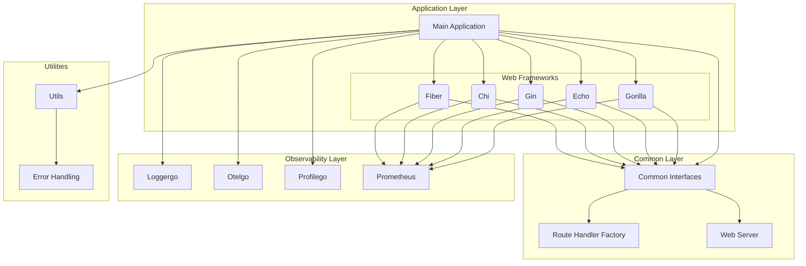

# System Architecture Overview

This document provides an architectural overview of the go-hello-world application, including system components, relationships, and observability integration patterns.

## Architecture Diagram



## Component Relationships

### Main Application
- **Purpose**: Entry point of the application
- **Responsibilities**: 
  - Configuration management
  - Observability setup (logging, tracing, profiling)
  - Framework selection and switching
  - Signal handling for graceful shutdown

### Web Frameworks Layer
The application supports multiple web frameworks through a common abstraction:

- **Gorilla**: Uses gorilla/mux router with graceful shutdown using sync.WaitGroup
- **Echo**: Uses echo framework with middleware approach
- **Gin**: Uses gin framework with recovery and logging middleware
- **Chi**: Uses chi router with graceful shutdown patterns
- **Fiber**: Uses fiber framework (Express.js inspired) with fasthttp

### Common Layer
- **Common Interfaces**: Defines shared interfaces across frameworks
- **Route Handler Factory**: Provides framework-agnostic route handler generation
- **Web Server**: Base server functionality shared across implementations

### Observability Layer
- **Loggergo**: Handles application logging with configurable levels and formats
- **Otelgo**: Provides OpenTelemetry tracing and metrics integration
- **Profilego**: Handles application profiling (with migration to new API)
- **Prometheus**: Provides metrics collection and exposure

## Framework Abstraction Layer

The application uses a web server abstraction pattern:

```
type WebServer struct {
    MU               sync.Mutex
    Running          bool
    Framework        string
    FrameworkOptions FrameworkOptions
}

type FrameworkOptions struct {
    ListenAddr      string
    OtelEnabled     bool
    StatsvizEnabled bool
    Tracer          trace.Tracer
    LogLevelConfig  *slog.LevelVar
    TraceProvider   trace.TracerProvider
}
```

### Common Methods
- `SetMainResponse()`: Creates standardized response for the main endpoint
- `SetLogLevelResponse()`: Handles logging level changes
- `SetFrameworkResponse()`: Handles framework switching
- Route handlers are now standardized using the RouteHandlerFactory

## Observability Integration Patterns

### Logging
- Uses slog with configurable levels and formats
- Integrates with OpenTelemetry when enabled
- Context-aware logging with structured data

### Tracing
- OpenTelemetry integration for distributed tracing
- Each request creates spans for different operations
- Tracer passed through framework options

### Metrics
- Prometheus metrics collection for HTTP requests
- Framework-specific middleware for request timing and counting
- Runtime metrics added for Go application insights

### Profiling
- Profilego integration for application profiling
- Migrated to new API with proper error handling
- Configurable profiling server address

## Data Flow

1. **Request Entry**: Requests enter through the selected web framework
2. **Common Processing**: Request data processed using common WebServer methods
3. **Response Generation**: Standardized response created using common methods
4. **Observability**: Logging, tracing, and metrics collected throughout
5. **Response Output**: Framework-specific response generation

## Configuration Flow

The application uses both command-line flags and environment variables for configuration:

- **Command-Line Flags**: Primary configuration method
- **Environment Variables**: Fallback and service identification
- **Runtime Configuration**: Framework switching via channel communication

## Error Handling Architecture

- **Standardized Error Types**: Uses common error categories (config, runtime, framework, validation)
- **Error Wrapping**: Preserves error context with additional information
- **Classification**: Errors are classified and metrics are collected
- **Framework Integration**: Consistent error handling across all frameworks